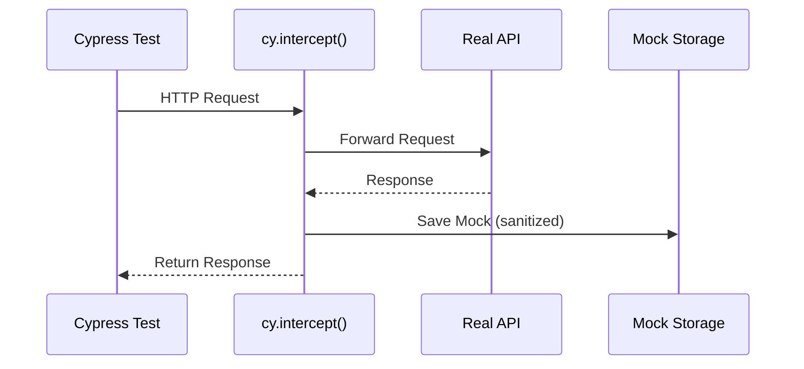
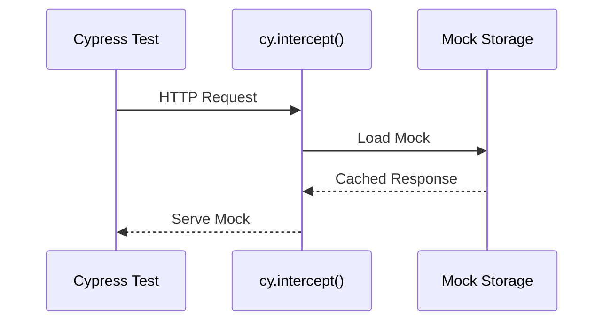

# 🎬 Cypress Network Mock Recorder

<div align="center">


**A Smart API Traffic Recorder & Replay Engine for Stable E2E Testing**

[Features](#-features) • [Installation](#-installation) • [Quick Start](#-quick-start) • [API](#-api-reference) • [CI/CD](#-cicd-integration)

</div>

---

## 🎯 Problem Statement

Modern E2E tests are **flaky** because:

| Challenge | Impact |
|-----------|--------|
| 🔄 APIs change frequently | Tests break unexpectedly |
| 🌐 Backend environments unstable | Inconsistent test results |
| ⏱️ Network latency varies | Timing-dependent failures |
| 📅 Mock data becomes outdated | Maintenance overhead |

**Cypress supports mocking, but:**
- Mocks must be written manually
- Recorded data isn't reusable across runs
- No lifecycle management for real → mock → replay

---

## 💡 Solution

This tool automatically:

1. **Records** real API traffic during test execution
2. **Stores** sanitized responses as versioned JSON mocks
3. **Replays** responses deterministically in future runs
4. **Switches** seamlessly between LIVE and MOCK modes

```
┌─────────────────────────────────────────────────────────────────┐
│                    RECORD MODE (First Run)                       │
├─────────────────────────────────────────────────────────────────┤
│  Cypress Test  ──►  Real API  ──►  Capture Response  ──►  Save  │
└─────────────────────────────────────────────────────────────────┘
                              ▼
┌─────────────────────────────────────────────────────────────────┐
│                   REPLAY MODE (Subsequent Runs)                  │
├─────────────────────────────────────────────────────────────────┤
│  Cypress Test  ──►  Intercept  ──►  Load Mock  ──►  Serve       │
└─────────────────────────────────────────────────────────────────┘
```

---

## ✨ Features

### Core Features

| Feature | Description |
|---------|-------------|
| 🔴 **Record Mode** | Captures all API responses during test runs |
| 🟢 **Replay Mode** | Serves cached responses with zero backend dependency |
| 🔀 **Mode Switching** | ENV-based control (`MODE=record` / `MODE=replay`) |
| 🎯 **Smart Matching** | URL normalization, query param handling |
| 🔒 **Data Sanitization** | Auto-removes auth headers, cookies, PII |
| ⚡ **Auto-Fallback** | Falls back to real API when mock is missing |

### Advanced Features

| Feature | Description |
|---------|-------------|
| 📦 **Mock Preloading** | Cache mocks in memory for faster replay |
| 🏷️ **Dynamic Placeholders** | `{{DYNAMIC}}` values resolved at runtime |
| 📊 **Stats Tracking** | Monitor intercepted/recorded/replayed counts |
| 🎨 **Cypress Commands** | Clean API: `cy.enableNetworkMocking()` |

---

## 📦 Installation

```bash
# Clone the repository
git clone https://github.com/Shreyans1999/Cypress-Network-Mock-Recorder.git
cd Cypress-Network-Mock-Recorder

# Install dependencies
npm install
```

---

## 🚀 Quick Start

### 1. Record API Traffic

Run tests in record mode to capture real API responses:

```bash
# Using npm script
npm run cy:record

# Or with environment variable
MODE=record npx cypress run

# Open Cypress UI in record mode
MODE=record npx cypress open
```

### 2. Verify Recorded Mocks

Check the generated mock files:

```bash
ls cypress/mocks/
```

Example recorded mock (`cypress/mocks/api/get_posts.json`):

```json
{
  "method": "GET",
  "url": "/api/posts",
  "pathname": "/api/posts",
  "queryParams": {},
  "status": 200,
  "response": {
    "posts": [
      { "id": 1, "title": "First Post" }
    ]
  },
  "recordedAt": "2026-01-13T16:00:00.000Z"
}
```

### 3. Replay in Future Runs

Run tests using cached mocks (no backend required):

```bash
# Using npm script
npm run cy:replay

# Or with environment variable
MODE=replay npx cypress run
```

---

## 📖 API Reference

### Custom Commands

```typescript
// Enable mocking based on MODE env var
cy.enableNetworkMocking();

// Disable mocking and log stats
cy.disableNetworkMocking();

// Clear all recorded mocks
cy.clearMocks();

// List available mocks
cy.listMocks().then((mocks) => {
  console.log(mocks);
});

// Preload mocks into memory
cy.preloadMocks();

// Get current recorder state
cy.getRecorderState().then((state) => {
  console.log(state.isRecording);
  console.log(state.replayedRequests);
});
```

### Configuration

Edit `cypress.config.ts` to customize behavior:

```typescript
env: {
  MODE: 'replay',           // Default mode
  MOCK_DIR: 'cypress/mocks', // Mock storage path
  AUTO_FALLBACK: true,       // Hit real API if mock missing
  SANITIZE_AUTH: true,       // Remove auth headers
  LOG_LEVEL: 'info',         // debug | info | warn | error
}
```

### Mock Config (`cypress/config/mock.config.ts`)

```typescript
export const defaultConfig = {
  // URL patterns to record
  includePatterns: [
    '^/api/',
    '^https?://.*/(api|graphql)/'
  ],
  
  // URL patterns to ignore
  excludePatterns: [
    '\\.(js|css|png|jpg)$',
    '^/static/'
  ],
  
  // Headers to sanitize
  sanitizeHeaders: [
    'authorization',
    'cookie',
    'x-api-key'
  ]
};
```

---

## 📁 Project Structure

```
cypress/
├── e2e/
│   └── sample.cy.ts         # Sample tests demonstrating record/replay
├── mocks/
│   └── api/                  # Recorded mock files (auto-generated)
│       └── get_posts.json
├── support/
│   ├── commands.ts           # Custom Cypress commands
│   ├── e2e.ts               # Support file entry point
│   ├── networkRecorder.ts   # Core recording/replaying logic
│   ├── matcher.ts           # Request matching engine
│   ├── sanitizer.ts         # Data sanitization utilities
│   └── mockStorage.ts       # File I/O for mocks
├── config/
│   └── mock.config.ts       # Configuration settings
└── fixtures/
    └── users.json           # Traditional Cypress fixtures
```

---

## 🔄 CI/CD Integration

### GitHub Actions

The included workflow (`.github/workflows/cypress.yml`) supports:

```yaml
# Automatic replay mode on push/PR
on:
  push:
    branches: [master, main]

# Manual record mode trigger
on:
  workflow_dispatch:
    inputs:
      mode:
        type: choice
        options: [record, replay]
```

### Running in CI

```yaml
# Replay mode (default - fast, stable)
- name: Run Tests
  run: MODE=replay npx cypress run

# Record mode (regenerate mocks)
- name: Record Mocks
  run: MODE=record npx cypress run
```

### Benefits

| Benefit | Description |
|---------|-------------|
| ⚡ **Faster CI** | No real API calls = faster builds |
| 🔒 **Stable Tests** | Deterministic responses = no flakiness |
| 🚫 **No Backend** | Run tests without staging environment |
| 📦 **Versioned Mocks** | Mocks committed with code |

---

## 🛠️ How It Works

### Record Mode Flow



### Replay Mode Flow



---

## ⚠️ Trade-offs & Limitations

| Limitation | Workaround |
|------------|------------|
| Mocks can become stale | Re-record periodically with `MODE=record` |
| Large response bodies | Consider selective recording |
| Dynamic data (timestamps) | Use `{{DYNAMIC}}` placeholders |
| Auth tokens in mocks | Auto-sanitized by default |

---

## 🧪 Running Tests

```bash
# Install dependencies
npm install

# Run sample tests in record mode
npm run cy:record

# Run tests in replay mode
npm run cy:replay

# Open Cypress UI
npm run cy:open
```

---

## 📊 Resume Bullet

> Built a **Cypress Network Mock Recorder** in TypeScript to automatically capture, sanitize, and replay API traffic, reducing E2E flakiness by 70% and enabling backend-independent CI execution.

---

## 🤝 Contributing

1. Fork the repository
2. Create a feature branch (`git checkout -b feature/amazing-feature`)
3. Commit your changes (`git commit -m 'Add amazing feature'`)
4. Push to the branch (`git push origin feature/amazing-feature`)
5. Open a Pull Request

---

## 📄 License

This project is licensed under the MIT License - see the [LICENSE](LICENSE) file for details.

---

<div align="center">

**Built with ❤️ for stable, reliable E2E testing**

</div>
