# Cypress Network Mock Recorder - Complete Walkthrough

> A comprehensive technical analysis for experienced QA/SDET professionals new to this codebase.

---

## 1. Project Purpose & Architecture

### What Problem Does This Solve?

E2E tests are inherently **flaky** due to:
- Backend environments being unstable
- Network latency variations
- API responses changing between test runs
- Manual mock maintenance overhead

### Solution Architecture

This framework provides a **Record-Replay** pattern for API traffic:


### Key Design Decisions

| Aspect | Decision | Rationale |
|--------|----------|-----------|
| **Storage** | JSON files | Version-controllable, human-readable |
| **Matching** | URL + Method + Query Params | Deterministic request identification |
| **Sanitization** | Auto-remove auth headers/cookies | Prevent sensitive data leakage |
| **Fallback** | Auto-record missing mocks | Graceful degradation in replay mode |

---

## 2. Entry Points & Execution Flow

### How Tests Start

The execution begins when you run one of these npm scripts defined in [package.json](file:///Users/shreyanssaklecha/Network-Mock-Recorder/package.json):

```bash
# Record Mode - Captures real API traffic
npm run cy:record    # MODE=record cypress run

# Replay Mode - Uses cached responses  
npm run cy:replay    # MODE=replay cypress run

# Interactive UI
npm run cy:open      # cypress open
```

### Initialization Chain


### Mode Detection Flow

```typescript
// From networkRecorder.ts - getMode()
export function getMode(): 'record' | 'replay' | 'passthrough' {
    const mode = Cypress.env('MODE')?.toLowerCase();
    if (mode === 'record') return 'record';
    if (mode === 'replay' || mode === 'mock') return 'replay';
    return 'passthrough';  // Default: no interception
}
```

---

## 3. Folder & File Responsibilities

### Project Structure Map

```
📁 Network-Mock-Recorder/
├── 📄 cypress.config.ts          ← Main Cypress config + Node.js tasks
├── 📄 package.json               ← npm scripts & dependencies
├── 📄 tsconfig.json              ← TypeScript configuration
│
├── 📁 cypress/
│   ├── 📁 config/
│   │   └── 📄 mock.config.ts     ← Central configuration (patterns, sanitization rules)
│   │
│   ├── 📁 support/
│   │   ├── 📄 e2e.ts             ← 🚀 ENTRY POINT - Loads all modules
│   │   ├── 📄 commands.ts        ← 🎮 Custom Cypress commands (API for tests)
│   │   ├── 📄 networkRecorder.ts ← 🧠 CORE LOGIC - Record/Replay orchestration
│   │   ├── 📄 matcher.ts         ← 🔍 URL matching & filename generation
│   │   ├── 📄 sanitizer.ts       ← 🔒 Security sanitization (headers, PII)
│   │   └── 📄 mockStorage.ts     ← 💾 File I/O & caching
│   │
│   ├── 📁 e2e/
│   │   └── 📄 sample.cy.ts       ← 🧪 Sample test demonstrating usage
│   │
│   ├── 📁 mocks/                 ← 📦 Generated mock files (auto-created)
│   │   └── 📁 posts/
│   │       └── 📄 get_posts.json
│   │
│   └── 📁 fixtures/              ← Traditional Cypress fixtures
│
└── 📁 .github/workflows/
    └── 📄 cypress.yml            ← 🔄 CI/CD pipeline
```

### File Dependency Graph


---

## 4. Core Logic & Important Components

### 4.1 Network Recorder ([networkRecorder.ts](file:///Users/shreyanssaklecha/Network-Mock-Recorder/cypress/support/networkRecorder.ts))

> **Purpose**: The brain of the framework - orchestrates record/replay modes

#### Key Functions

| Function | Purpose |
|----------|---------|
| `getMode()` | Reads `MODE` env var → returns `record`, `replay`, or `passthrough` |
| `initNetworkRecorder()` | Sets up `cy.intercept()` based on mode |
| `setupRecordMode()` | Intercepts all requests → forwards to real API → saves responses |
| `setupReplayMode()` | Intercepts requests → loads mocks → serves cached responses |
| `stopNetworkRecorder()` | Logs stats and resets state |

#### Record Mode Flow

```typescript
// Simplified from setupRecordMode()
cy.intercept('**', (req) => {
    if (!shouldRecordUrl(req.url)) {
        req.continue();  // Skip excluded URLs
        return;
    }

    req.continue((res) => {
        // Capture the real response
        saveMock(
            { method: req.method, url: req.url, ... },
            { statusCode: res.statusCode, body: res.body, ... }
        );
    });
});
```

#### Replay Mode Flow

```typescript
// Simplified from setupReplayMode()
cy.intercept('**', (req) => {
    loadMock(signature).then((mock) => {
        if (mock) {
            req.reply({ statusCode: mock.status, body: mock.response });
        } else if (config.autoFallback) {
            req.continue();  // Hit real API and auto-record
        } else {
            req.reply({ statusCode: 500, body: { error: 'Mock not found' } });
        }
    });
});
```

---

### 4.2 Request Matcher ([matcher.ts](file:///Users/shreyanssaklecha/Network-Mock-Recorder/cypress/support/matcher.ts))

> **Purpose**: Creates unique identifiers for API requests to match against stored mocks

#### Key Functions

| Function | Purpose |
|----------|---------|
| `createRequestSignature()` | Creates unique signature from method + URL |
| `normalizeUrl()` | Sorts query params for consistent matching |
| `generateMockFilename()` | Creates filesystem-safe filename |
| `generateMockPath()` | Determines full path for mock storage |
| `shouldRecordUrl()` | Checks include/exclude patterns |

#### Filename Generation Example

```
Request: GET https://api.example.com/users?sort=desc&page=1
           ↓
Signature: { method: "GET", pathname: "/users", queryParams: {page:"1", sort:"desc"} }
           ↓
Filename:  "get_users_abc123.json"  (abc123 = hash of query params)
           ↓
Full Path: "cypress/mocks/users/get_users_abc123.json"
```

---

### 4.3 Data Sanitizer ([sanitizer.ts](file:///Users/shreyanssaklecha/Network-Mock-Recorder/cypress/support/sanitizer.ts))

> **Purpose**: Removes sensitive data before storing mocks

#### What Gets Sanitized?

| Data Type | Handling | Example |
|-----------|----------|---------|
| Auth Headers | Replaced with `***REMOVED***` | `Authorization: Bearer xxx` |
| Cookies | Removed entirely | `Set-Cookie: session=abc` |
| API Keys in URLs | Masked | `?api_key=***REMOVED***` |
| PII (optional) | Pattern-based replacement | Emails → `***EMAIL***` |

#### PII Detection Patterns

```typescript
// From mock.config.ts
export const piiPatterns = [
    { pattern: /email-regex/g, replacement: '***EMAIL***' },
    { pattern: /phone-regex/g, replacement: '***PHONE***' },
    { pattern: /credit-card-regex/g, replacement: '***CARD***' },
    { pattern: /jwt-regex/g, replacement: '***JWT***' },
];
```

---

### 4.4 Mock Storage ([mockStorage.ts](file:///Users/shreyanssaklecha/Network-Mock-Recorder/cypress/support/mockStorage.ts))

> **Purpose**: Handles file I/O and in-memory caching

#### Key Functions

| Function | Purpose |
|----------|---------|
| `saveMock()` | Writes sanitized response to JSON file |
| `loadMock()` | Reads mock from file (with caching) |
| `preloadMocks()` | Loads all mocks into memory for faster replay |
| `listMocks()` | Returns all available mock files |
| `clearAllMocks()` | Deletes all recorded mocks |

#### Mock File Structure

```json
// cypress/mocks/posts/get_posts.json
{
  "method": "GET",
  "url": "https://jsonplaceholder.typicode.com/posts",
  "pathname": "/posts",
  "queryParams": {},
  "status": 200,
  "response": [
    { "id": 1, "title": "First Post", ... }
  ],
  "responseTime": 150,
  "recordedAt": "2026-01-19T16:00:00.000Z"
}
```

---

### 4.5 Custom Commands ([commands.ts](file:///Users/shreyanssaklecha/Network-Mock-Recorder/cypress/support/commands.ts))

> **Purpose**: Exposes functionality as clean Cypress commands

| Command | Usage | Description |
|---------|-------|-------------|
| `cy.enableNetworkMocking()` | In `beforeEach` | Enables record/replay based on MODE |
| `cy.disableNetworkMocking()` | In `afterEach` | Stops and logs stats |
| `cy.clearMocks()` | Setup/Cleanup | Deletes all mock files |
| `cy.listMocks()` | Debug | Returns array of mock filenames |
| `cy.preloadMocks()` | Performance | Caches mocks in memory |
| `cy.getRecorderState()` | Debug | Returns current stats |
| `cy.getMode()` | Debug | Returns current mode |

---

## 5. Configuration & Environment Handling

### Environment Variables

| Variable | Values | Default | Description |
|----------|--------|---------|-------------|
| `MODE` | `record`, `replay`, `passthrough` | `replay` | Operating mode |
| `MOCK_DIR` | Path | `cypress/mocks` | Mock storage location |
| `AUTO_FALLBACK` | `true`/`false` | `true` | Auto-record missing mocks |
| `LOG_LEVEL` | `debug`, `info`, `warn`, `error` | `info` | Logging verbosity |

### Configuration Files

````carousel
#### [cypress.config.ts](file:///Users/shreyanssaklecha/Network-Mock-Recorder/cypress.config.ts)

**Primary Cypress configuration + Node.js tasks**

```typescript
export default defineConfig({
    e2e: {
        baseUrl: 'https://jsonplaceholder.typicode.com',
        specPattern: 'cypress/e2e/**/*.cy.ts',
        supportFile: 'cypress/support/e2e.ts',
        
        setupNodeEvents(on, config) {
            on('task', {
                readMock({ filePath }) { /* ... */ },
                writeMock({ filePath, data }) { /* ... */ },
                listMocks({ dirPath }) { /* ... */ },
                clearMocks({ dirPath }) { /* ... */ },
            });
        },
    },
    env: {
        MODE: 'replay',
        MOCK_DIR: 'cypress/mocks',
        AUTO_FALLBACK: true,
    },
});
```
<!-- slide -->
#### [mock.config.ts](file:///Users/shreyanssaklecha/Network-Mock-Recorder/cypress/config/mock.config.ts)

**URL patterns & sanitization rules**

```typescript
export const defaultConfig: MockConfig = {
    mockDir: 'cypress/mocks',

    // URLs to record
    includePatterns: [
        '^/api/',
        '^https?://.*/(api|graphql)/.*',
    ],

    // URLs to skip
    excludePatterns: [
        '\\.(js|css|png|jpg)$',
        '^/static/',
    ],

    // Headers to sanitize
    sanitizeHeaders: [
        'authorization',
        'cookie',
        'x-api-key',
    ],

    autoFallback: true,
    logLevel: 'info',
};
```
````

---

## 6. Test/Automation Workflow

### Typical Test Pattern

```typescript
// From sample.cy.ts
describe('API Tests', () => {
    beforeEach(() => {
        cy.enableNetworkMocking();  // 🎬 Start recording/replaying
    });

    afterEach(() => {
        cy.disableNetworkMocking();  // ⏹️ Stop and log stats
    });

    it('should fetch posts', () => {
        // This request will be:
        // - RECORD mode: Hit real API, save response
        // - REPLAY mode: Return cached response
        cy.request('GET', '/posts').then((response) => {
            expect(response.status).to.eq(200);
            expect(response.body).to.be.an('array');
        });
    });
});
```

### Complete Workflow Diagram

```mermaid
flowchart TB
    subgraph "Developer Workflow"
        A[1️⃣ Write Test] --> B{First Run?}
        B -->|Yes| C[2️⃣ Run in RECORD mode]
        C --> D[Tests hit real API]
        D --> E[Responses saved to cypress/mocks/]
        E --> F[3️⃣ Commit mocks with code]
        B -->|No| G[4️⃣ Run in REPLAY mode]
        F --> G
        G --> H[Tests use cached responses]
        H --> I{Tests Pass?}
        I -->|Yes| J[✅ Done]
        I -->|No| K{Mock outdated?}
        K -->|Yes| C
        K -->|No| L[Fix test code]
        L --> G
    end
```



### Running Tests Locally

```bash
# Step 1: Record fresh mocks (run when API changes)
npm run cy:record

# Step 2: Check generated mocks
ls cypress/mocks/

# Step 3: Run tests using cached mocks (fast, deterministic)
npm run cy:replay

# Step 4: Interactive debugging
npm run cy:open  # Then set MODE=record or MODE=replay in Cypress UI
```

---

## 7. CI/CD & Integrations

### GitHub Actions Workflow

The [cypress.yml](file:///Users/shreyanssaklecha/Network-Mock-Recorder/.github/workflows/cypress.yml) workflow supports two modes:

```mermaid
flowchart LR
    subgraph "CI Pipeline"
        A[Push/PR] -->|Default| B[🟢 Replay Mode]
        A -->|Manual Trigger| C{Mode?}
        C -->|record| D[🔴 Record Mode]
        C -->|replay| B
        B --> E[Fast, No API calls]
        D --> F[Hits Real API]
        F --> G[Upload Mocks Artifact]
        G --> H[Auto-commit to master]
    end
```



### Workflow Jobs

| Job | Trigger | Purpose |
|-----|---------|---------|
| `test-replay` | Push/PR (default) | Uses cached mocks, fast execution |
| `test-record` | Manual dispatch | Regenerates mocks from real API |
| `commit-mocks` | After record on master | Auto-commits updated mocks |

### Benefits for CI/CD

| Benefit | Impact |
|---------|--------|
| ⚡ **Faster CI** | No real API calls = 3-5x faster builds |
| 🔒 **Deterministic** | Same mocks = predictable results |
| 🚫 **No Backend Required** | Tests run without staging environment |
| 📦 **Versioned Mocks** | Mocks are committed with test code |

---

## Quick Reference

### Key Commands Quick Reference

```bash
# Local Development
npm run cy:record          # Record new mocks
npm run cy:replay          # Use cached mocks
npm run cy:open            # Interactive UI

# Inside Tests
cy.enableNetworkMocking()  # Start in beforeEach
cy.disableNetworkMocking() # Stop in afterEach
cy.getRecorderState()      # Check stats
cy.listMocks()             # See available mocks
```

### Important File Paths

| Path | Description |
|------|-------------|
| [cypress.config.ts](file:///Users/shreyanssaklecha/Network-Mock-Recorder/cypress.config.ts) | Main config + Node tasks |
| [cypress/support/e2e.ts](file:///Users/shreyanssaklecha/Network-Mock-Recorder/cypress/support/e2e.ts) | Entry point |
| [cypress/support/networkRecorder.ts](file:///Users/shreyanssaklecha/Network-Mock-Recorder/cypress/support/networkRecorder.ts) | Core logic |
| [cypress/config/mock.config.ts](file:///Users/shreyanssaklecha/Network-Mock-Recorder/cypress/config/mock.config.ts) | URL patterns |
| `cypress/mocks/` | Generated mock files |

---

## Summary

This Cypress Network Mock Recorder follows a clean, modular architecture:

1. **Entry**: `e2e.ts` → `commands.ts` → Tests
2. **Core**: `networkRecorder.ts` orchestrates everything
3. **Helpers**: `matcher.ts`, `sanitizer.ts`, `mockStorage.ts`
4. **Config**: `mock.config.ts` + `cypress.config.ts`
5. **CI/CD**: GitHub Actions with record/replay support

The framework elegantly solves E2E test flakiness by providing a transparent record-replay layer that requires minimal test code changes.
